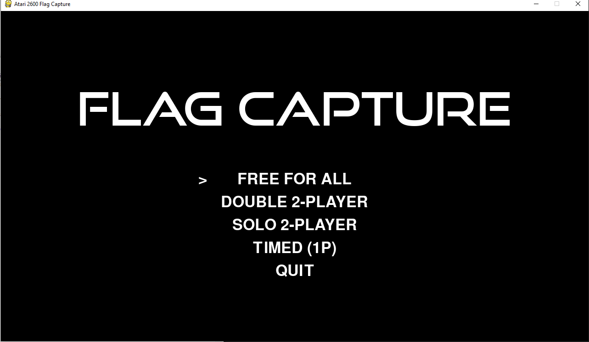
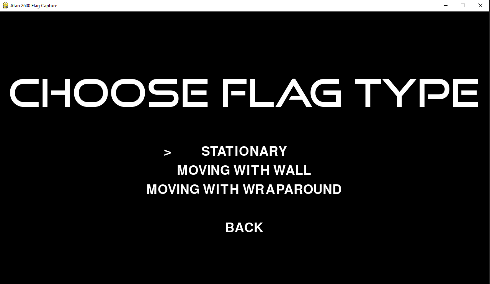

Flag Capture is a video game published in 1978 by Atari, Inc. for the Atari 2600. It is based on the traditional game Capture the flag. 

This is an attempt to remake the game with the help of PyGame module.

Just clone this repo and hop onto this Nostalgic trip.

  
  

